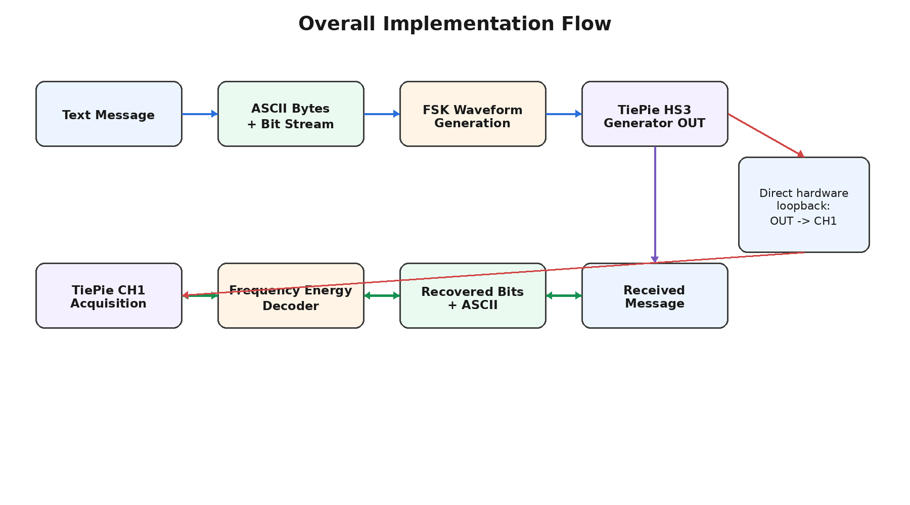
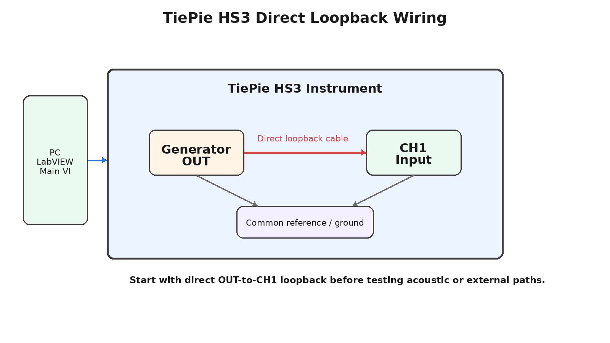
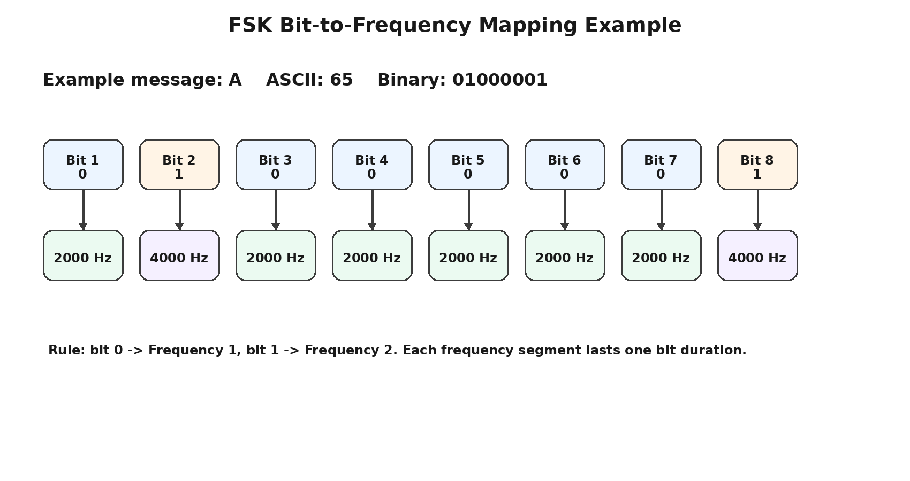
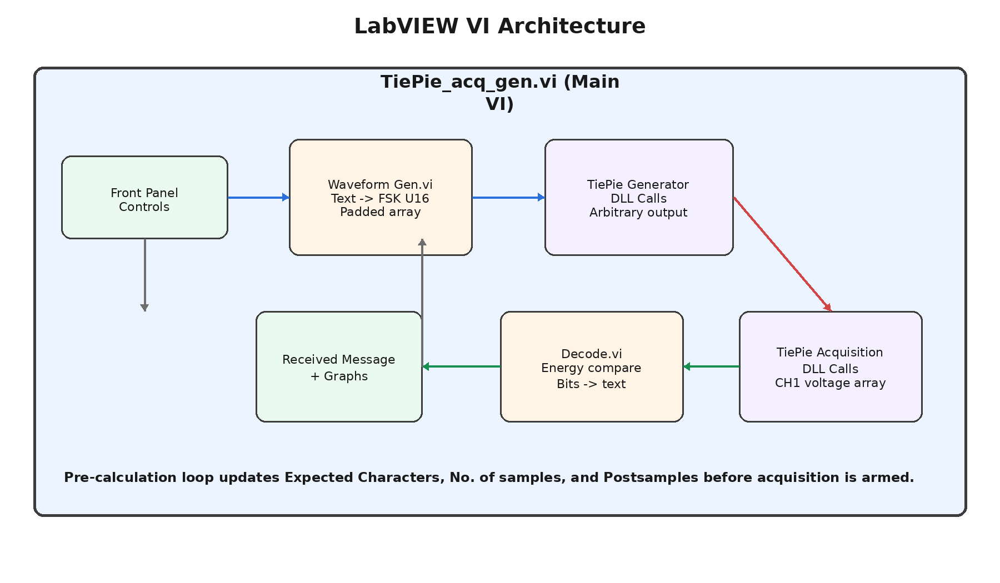

# LabVIEW TiePie HS3 FSK Message Transmission and Decoding

A professional LabVIEW engineering project for generating a text message as a two-frequency FSK waveform, transmitting it with the TiePie HS3 arbitrary waveform generator, acquiring the signal on CH1, decoding the received waveform, and displaying the reconstructed message.

## Repository Name

Recommended repository name:

```text
labview-tiepie-hs3-fsk-message-transmission
```

## Repository Description

```text
LabVIEW project for FSK message generation, TiePie HS3 arbitrary waveform transmission, CH1 acquisition, and frequency-energy based decoding back into text.
```

## Project Overview

This project implements a direct hardware loopback test:

```text
TiePie HS3 Generator OUT  ->  TiePie HS3 CH1 Input
```

The system converts a text message into binary bits. Each bit is represented by a sine wave segment at one of two frequencies:

- Bit `0` -> Frequency 1, normally 2000 Hz
- Bit `1` -> Frequency 2, normally 4000 Hz

The generated FSK signal is loaded into the TiePie HS3 generator as an arbitrary waveform. The same signal is acquired on CH1 and decoded back into the original text message.

## Key Features

- Text-to-binary message encoding
- Two-frequency FSK waveform generation
- TiePie HS3 arbitrary waveform playback through DLL calls
- Direct OUT-to-CH1 loopback acquisition
- Automatic sample-count and post-sample calculation
- U16 waveform conversion for generator memory
- Padded waveform length using next power-of-two memory sizing
- Frequency-energy based FSK decoding
- ASCII reconstruction from recovered bit stream
- Beginner-friendly documentation and troubleshooting notes


## Diagram Preview

### Overall Flow



### TiePie Loopback Wiring



### FSK Bit Mapping



### LabVIEW VI Architecture



## Main Files

| File | Purpose |
|---|---|
| `TiePie_acq_gen.vi` | Main VI and project controller |
| `Waveform Gen.vi` | Generates the FSK transmit waveform |
| `Decode.vi` | Decodes the acquired waveform back into text |
| `hs3.dll` | TiePie HS3 DLL interface |
| `hs3f8.hex` / `hs3f12.hex` | TiePie support firmware files |

> Note: The ZIP includes documentation and reference materials. Copy your actual `.vi`, `.dll`, and `.hex` files into the `labview/` and `vendor/` folders before uploading, unless you are keeping those files private.

## System Requirements

- LabVIEW installed on Windows
- TiePie HS3 hardware
- TiePie HS3 DLL support files
- Direct cable connection from generator OUT to CH1 for loopback testing
- Existing project files: `TiePie_acq_gen.vi`, `Waveform Gen.vi`, and `Decode.vi`

## Hardware Connection

| TiePie Terminal | Connect To | Purpose |
|---|---|---|
| Generator OUT | CH1 input | Sends the generated FSK waveform into the acquisition channel |
| Ground/reference | Common ground | Keeps generator and acquisition reference aligned |

For the initial test, use the direct loopback connection before attempting an acoustic or external channel path.

## FSK Working Principle

Example for character `A`:

```text
ASCII A = decimal 65
Binary = 01000001
```

If:

```text
Frequency 1 = 2000 Hz
Frequency 2 = 4000 Hz
```

Then `A` is transmitted as:

```text
2000, 4000, 2000, 2000, 2000, 2000, 2000, 4000 Hz
```

Each frequency segment lasts for one bit duration, for example 0.05 seconds.

## Recommended Test Settings

| Parameter | Recommended Value |
|---|---:|
| Frequency 1 | 2000 Hz |
| Frequency 2 | 4000 Hz |
| Bit duration | 0.05 s |
| Sampling rate | 50000 Hz |
| Amplitude | About 1 V |
| DC offset | 0 V |
| Trigger source | Generator / Gen |
| CH1 coupling | DC |
| CH1 range | 2 V or suitable range |

## Important Formulas

Samples per bit:

```text
samples_per_bit = sampling_rate × bit_duration
```

Useful message samples:

```text
useful_samples = number_of_characters × 8 × samples_per_bit
```

Padded waveform length:

```text
padded_length = next_power_of_two(useful_samples)
```

Generator wait time:

```text
wait_ms = 1000 × padded_length / sampling_rate
```

U16 conversion for TiePie arbitrary waveform memory:

```text
U16_value = 32768 + 30000 × sine_signal
```

## How to Run

1. Connect TiePie generator OUT directly to CH1.
2. Open `TiePie_acq_gen.vi`.
3. Enter a test message, such as `A`, `AB`, or `ABCD`.
4. Set Frequency 1, Frequency 2, bit duration, sampling rate, amplitude, and offset.
5. Let the VI automatically update Expected Characters, No. of samples, and Postsamples.
6. Start acquisition first so CH1 is armed.
7. Start generation to transmit the FSK waveform.
8. Wait until acquisition is ready.
9. Read and decode the CH1 waveform.
10. Check the Received Message indicator.

## Folder Structure

```text
labview-tiepie-hs3-fsk-message-transmission/
├── README.md
├── LICENSE
├── .gitignore
├── REPOSITORY_INFO.md
├── docs/
│   ├── PROJECT_DOCUMENTATION.md
│   ├── HARDWARE_CONNECTIONS.md
│   ├── SOFTWARE_ARCHITECTURE.md
│   ├── FSK_WORKING.md
│   ├── WAVEFORM_GENERATION.md
│   ├── ACQUISITION_AND_DECODING.md
│   ├── CALCULATIONS.md
│   ├── TESTING_CHECKLIST.md
│   ├── TROUBLESHOOTING.md
│   └── GITHUB_UPLOAD_GUIDE.md
├── assets/
│   ├── overall_implementation_flow.png
│   ├── tiepie_loopback_connection.png
│   ├── fsk_bit_frequency_mapping.png
│   ├── labview_vi_architecture.png
│   ├── generation_chain.png
│   ├── acquisition_chain.png
│   ├── decoder_frequency_energy.png
│   ├── u16_conversion_and_padding.png
│   ├── one_shot_timing_sequence.png
│   └── example_fsk_waveform.png
├── examples/
│   └── sample_test_values.csv
├── labview/
│   └── README.md
├── vendor/
│   └── README.md
└── references/
    └── LabVIEW_TiePie_HS3_FSK_Code_Explanation.docx
```

## Troubleshooting Summary

| Problem | Likely Cause | Fix |
|---|---|---|
| Only noise on CH1 | Generator not outputting, wrong mode, wrong range | First verify a clean sine wave output |
| Sine works but FSK does not decode | Acquisition starts at wrong point | Arm acquisition first and use Gen trigger |
| One character works but multiple characters fail | Record length, post samples, or wait time not updated | Recalculate from padded waveform length |
| Received message is random during sine test | Decoder is being applied to non-FSK signal | Ignore decoder during sine-only testing |
| DLL call error | Missing or misplaced `hs3.dll` / firmware files | Place vendor files next to the VI or configure correct path |

## License

This repository is provided under the MIT License for the custom LabVIEW project documentation and non-vendor files. Vendor DLL/firmware files may have separate licensing restrictions and should not be redistributed unless permitted by the vendor.
